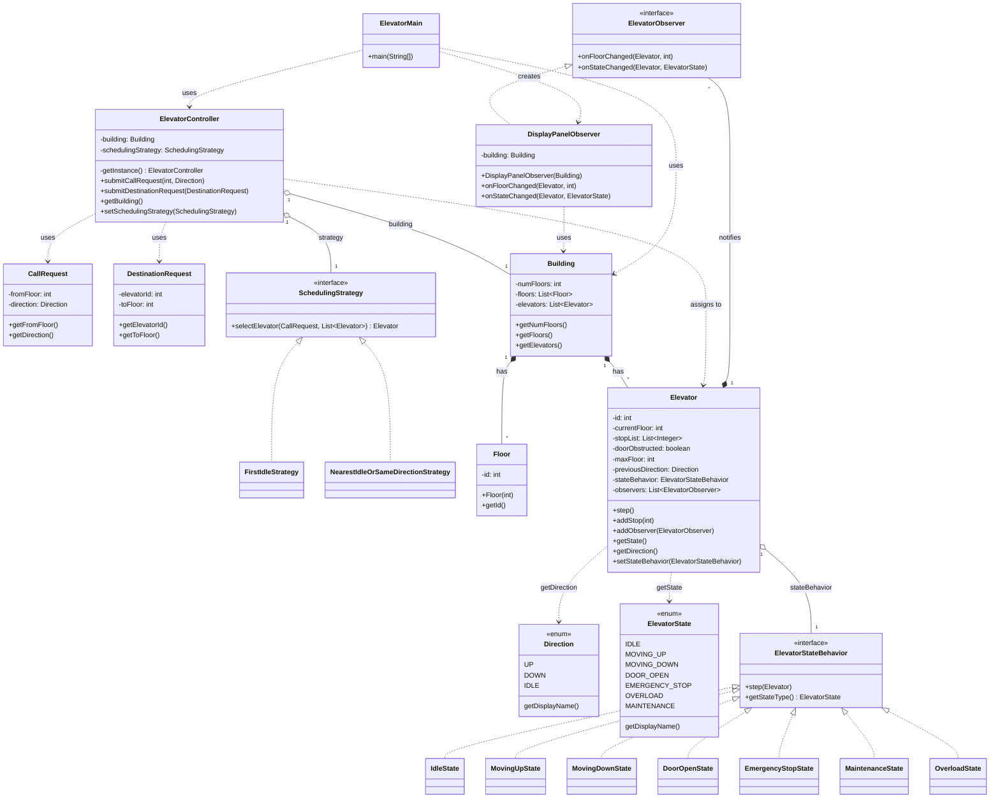
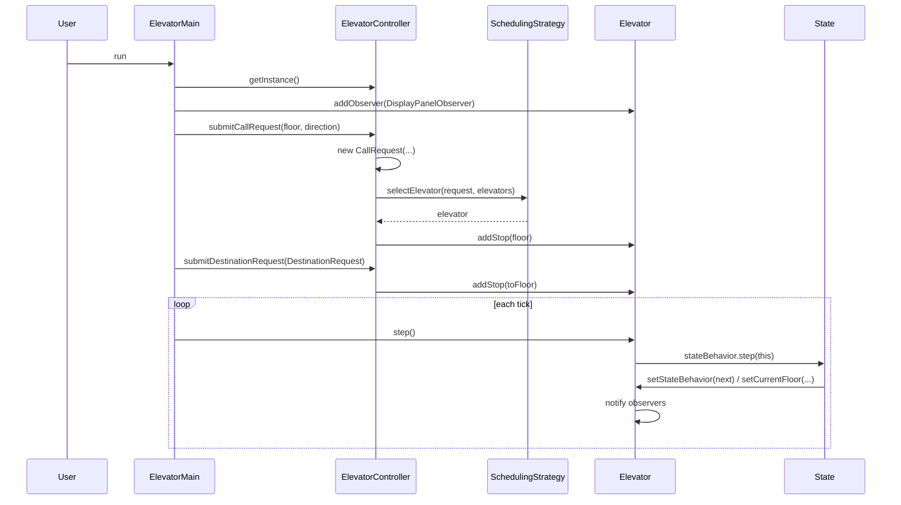

# Elevator System — Design Diagram

## Class diagram (Mermaid)



## Pattern summary

| Pattern   | Role |
|----------|------|
| **State** | `ElevatorStateBehavior` — one implementation per elevator state (Idle, MovingUp, MovingDown, DoorOpen, etc.). `Elevator.step()` delegates to `stateBehavior.step(this)`. |
| **Strategy** | `SchedulingStrategy` — selects which elevator handles a call. Controller uses `FirstIdleStrategy` (default) or `NearestIdleOrSameDirectionStrategy`. |
| **Observer** | `ElevatorObserver` — `Elevator` notifies observers on floor/state change. `DisplayPanelObserver` shows floor label, direction, state. |
| **Singleton** | `ElevatorController` — `getInstance()` (holder idiom); one controller per process. |

## Request flow



## File layout

```
Questions/ElevatorSystem/
├── design.md          (this file)
├── README.md
├── requirement.md
├── entities.md
├── approach.md
├── followup.md
├── Direction.java
├── ElevatorState.java
├── CallRequest.java
├── DestinationRequest.java
├── Floor.java
├── Building.java
├── Elevator.java
├── ElevatorStateBehavior.java
├── IdleState.java
├── MovingUpState.java
├── MovingDownState.java
├── DoorOpenState.java
├── EmergencyStopState.java
├── MaintenanceState.java
├── OverloadState.java
├── SchedulingStrategy.java
├── FirstIdleStrategy.java
├── NearestIdleOrSameDirectionStrategy.java
├── ElevatorObserver.java
├── DisplayPanelObserver.java
├── ElevatorController.java
└── ElevatorMain.java
```
