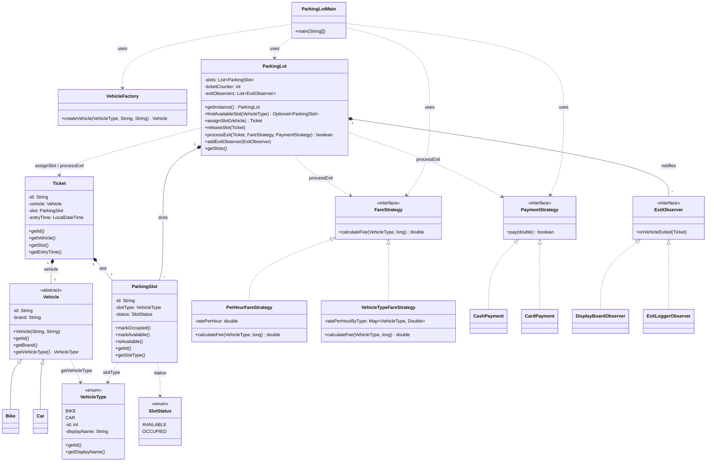
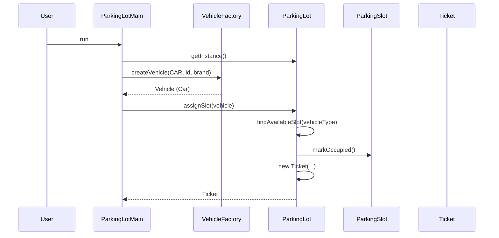
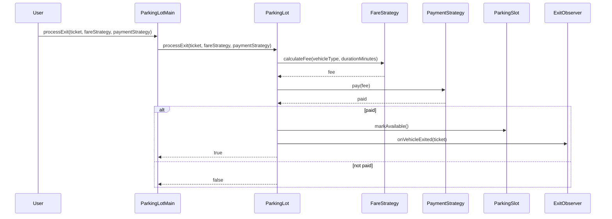

# Parking Lot — Design Diagram

## Class diagram (Mermaid)



## Pattern summary

| Pattern   | Role |
|----------|------|
| **Singleton** | `ParkingLot` — `getInstance()` (holder idiom); single lot instance per process. |
| **Factory** | `VehicleFactory.createVehicle(VehicleType, id, brand)` — creates `Car` or `Bike`; easy to add new vehicle types. |
| **Strategy (Fare)** | `FareStrategy` — `calculateFee(vehicleType, durationMinutes)`. Implementations: `PerHourFareStrategy`, `VehicleTypeFareStrategy`. |
| **Strategy (Payment)** | `PaymentStrategy` — `pay(amount)`. Implementations: `CashPayment`, `CardPayment`. |
| **Observer** | `ExitObserver` — `ParkingLot` notifies observers when a vehicle exits (after payment). Implementations: `DisplayBoardObserver`, `ExitLoggerObserver`. |

## Entry flow



## Exit flow



## File layout

```
Questions/ParkingLot/
├── design.md              (this file)
├── README.md
├── requirement.md
├── entities.md
├── approach.md
├── followup.md
├── VehicleType.java
├── SlotStatus.java
├── Vehicle.java
├── Car.java
├── Bike.java
├── VehicleFactory.java
├── ParkingSlot.java
├── Ticket.java
├── ParkingLot.java
├── FareStrategy.java
├── PerHourFareStrategy.java
├── VehicleTypeFareStrategy.java
├── PaymentStrategy.java
├── CashPayment.java
├── CardPayment.java
├── ExitObserver.java
├── DisplayBoardObserver.java
├── ExitLoggerObserver.java
└── ParkingLotMain.java
```
